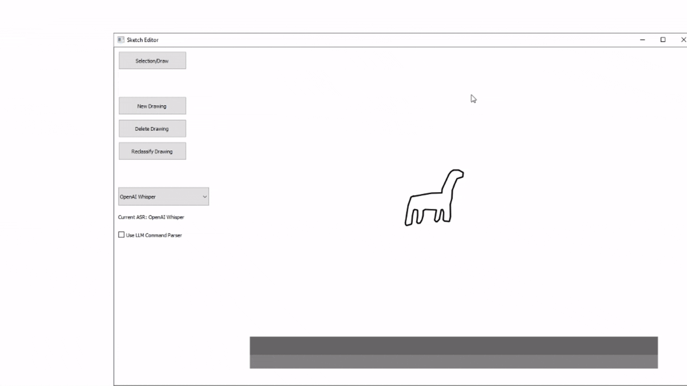
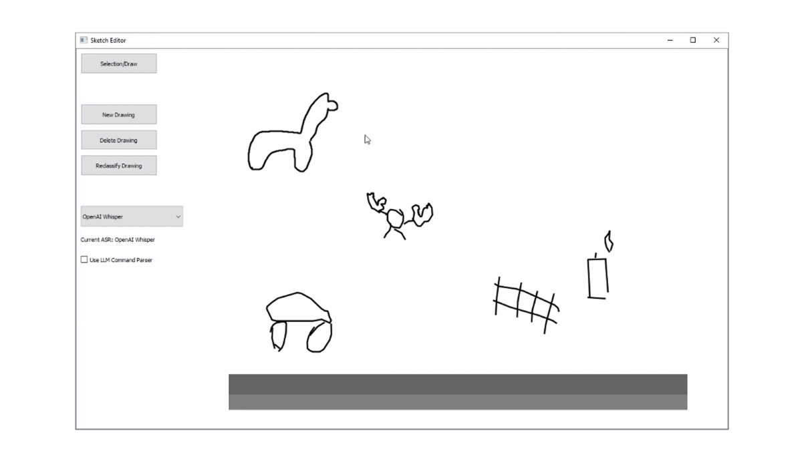
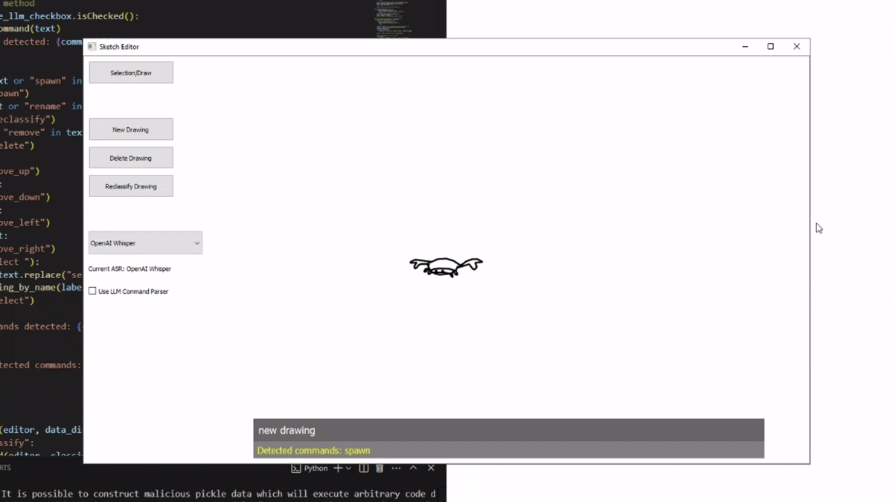
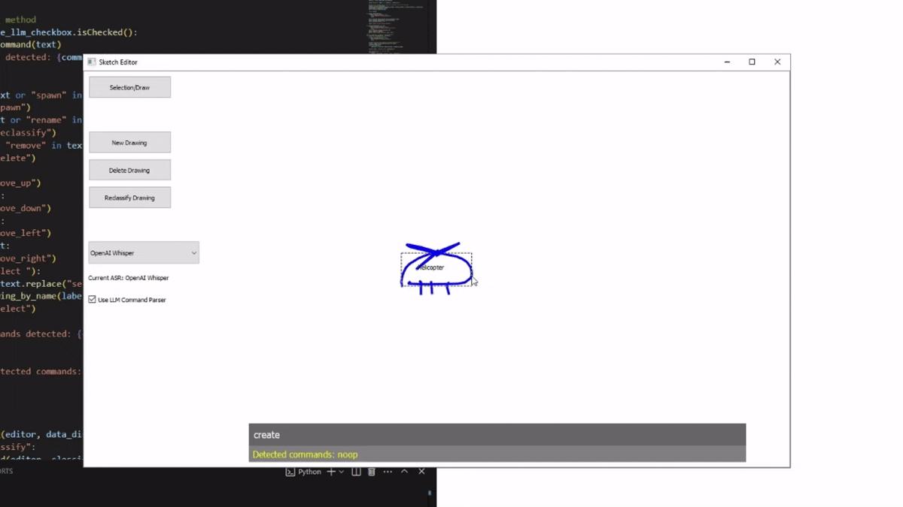

This is an interactive sketch editor (Python-based) inspired by MS Paint, where each drawing is represented as a collection of structured strokes. These strokes are treated as objects and can be:

- **Classified using a Convolutional Neural Network (CNN)** trained on sketch datasets.
- **Manipulated using voice commands** via speech recognition and natural language processing.

The system also explores **LLM integration** to convert natural language into executable editing commands.

---

## 🎥 Demonstrations

**Editor Demo**

**Sketch Recognition**

**Speech Recognitio**

**LLM integration**

---

## ✨ Features

- 🧠 **Sketch Classification**:
  - Trained custom CNNs on the [Quick, Draw!](https://quickdraw.withgoogle.com/data) dataset.
  - Compared results with pretrained models from OpenAI and Meta.

- 🗣️ **Speech-to-Command Interface**:
  - Used LibriSpeech-trained models for voice control.
  - Voice input allows manipulation of individual sketch elements (e.g. delete, move, recolor).

- 🧾 **Natural Language Interface**:
  - Integrated large language models (LLMs) to parse free-form instructions into editor actions.

- 🖼️ **Object-Oriented Drawing System**:
  - Drawings are not just pixel-based — each stroke is treated as a manipulable object.
  - Supports complex interactions like selection, grouping, and transformation.
 
- 🧰 Built with a Rich Python Stack:

  -Developed using a range of Python libraries including:
  
    -PyTorch for training and inference
  
    -Seaborn for data visualization and debugging
  
    -PyQt5 for the sketch editor interface

---
